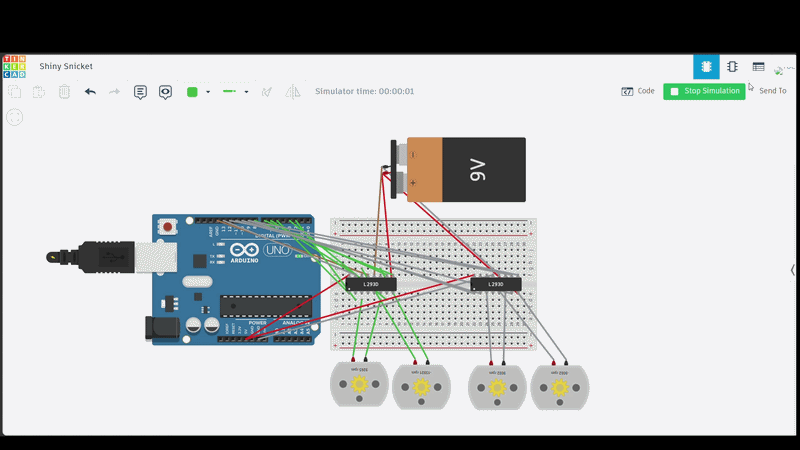

# DC Motor Control with L293D
##Description
This project demonstrates how to control four DC motors using two L293D motor drivers and an Arduino Uno.

##Tinkercad Simulation
Simulation link:
https://www.tinkercad.com/things/63m3ZauQT81-shiny-snicket

##Demonstration

## Components
- Arduino Uno
- 2 × L293D Motor Driver
- 4 × DC Motors
- 9V Battery
- Breadboard
- Jumper Wires

## Project Tasks
- Move forward for 30 seconds.
- Move backward for 60 seconds.
- Alternate between left and right turns for 60 seconds.

## Software
- Arduino IDE
- Tinkercad

## Author
Sara Rezgi
